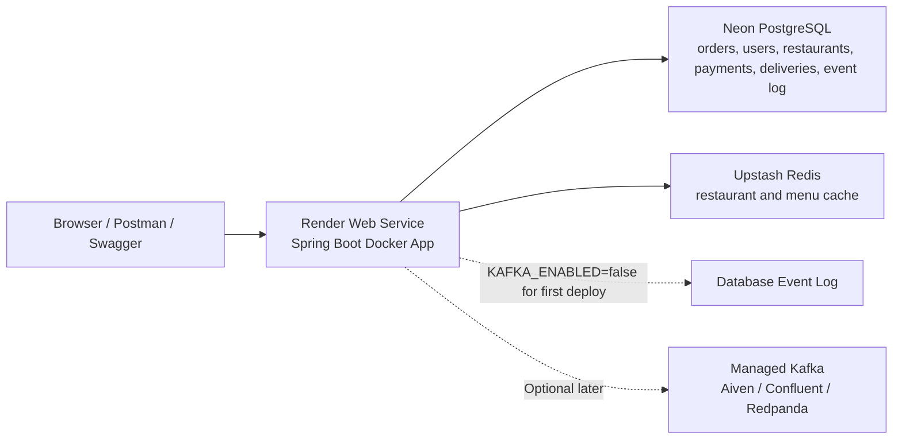

# Detailed Online Deployment Guide

This guide explains the simplest free deployment path for the Event-Driven Order Delivery System, then shows how to extend it later with managed Kafka.

The recommended first deployment is:

- App hosting: Render Free Web Service
- PostgreSQL: Neon Free Postgres
- Redis cache: Upstash Redis Free
- Kafka: disabled for the first low-cost cloud deployment with `KAFKA_ENABLED=false`

Why Kafka is disabled first: managed Kafka is the most complex part of the online setup because providers require extra security properties, certificates, or SASL settings. The application still records domain events in the database event log when Kafka is disabled, so the non-production environment remains testable online. You can enable real Kafka later.

Provider notes were checked on 2026-07-20:

- Render free web services are suitable for small non-production services, but they spin down when idle.
- Render free Postgres expires after 30 days, so Neon is a better free database choice for this project.
- Neon Free has no time limit and no credit card requirement.
- Upstash Redis Free is enough for this restaurant/menu caching workload.
- Aiven Kafka Free is a good later choice for a small managed Kafka environment.

Never commit secrets to GitHub and never paste passwords or API keys into chat. Enter credentials only inside provider dashboards such as Render, Neon, and Upstash.

## What Is Already Ready In This Repository

The repo already includes the deployment files needed for the simple cloud setup:

- `Dockerfile`: builds and runs the Spring Boot app with Java 21.
- `render.yaml`: Render Blueprint config for a free Docker web service.
- `src/main/resources/application.yml`: reads database, Redis, Kafka, JWT, and port settings from environment variables.
- `docker-compose.yml`: local-only infrastructure for PostgreSQL, Redis, Kafka, and Zookeeper.
- `postman/order-delivery.postman_collection.json`: endpoint testing collection.

The app uses `server.port=${SERVER_PORT:${PORT:8080}}`, so Render can provide its normal `PORT` value and the app will bind correctly.

## Final Cloud Architecture



## Step 0: Accounts You Need

Create or sign in to these accounts:

1. GitHub
   - The project is already pushed here:
   - `https://github.com/Dinesh12328/-Event-Driven-Order-Delivery-System`

2. Render
   - Used to run the Spring Boot Docker app.
   - You will connect Render to GitHub.

3. Neon
   - Used for PostgreSQL.
   - Recommended over Render free Postgres because Render free Postgres expires after 30 days.

4. Upstash
   - Used for Redis cache.

Do not create Kafka yet for the first deployment. Add Kafka after the app is live and tested.

## Step 1: Create The Neon PostgreSQL Database

1. Open the Neon Console.
2. Create a new project.
3. Choose a region close to your Render region if possible.
4. Keep the default database or create one named `order_delivery`.
5. Open the connection details or Connect modal.
6. Copy these values:
   - Host
   - Database name
   - Username or role name
   - Password

For Render, the app expects these three database environment variables:

```bash
DB_URL=jdbc:postgresql://<neon-host>:5432/<database-name>?sslmode=require
DB_USERNAME=<neon-username>
DB_PASSWORD=<neon-password>
```

Example shape only:

```bash
DB_URL=jdbc:postgresql://ep-example-123456.us-east-2.aws.neon.tech:5432/order_delivery?sslmode=require
DB_USERNAME=order_delivery_owner
DB_PASSWORD=<enter-in-render-dashboard>
```

Do not include your real password in the GitHub repo.

## Step 2: Create The Upstash Redis Database

1. Open the Upstash Console.
2. Create a Redis database.
3. Choose the Free plan.
4. Choose a region close to Render if possible.
5. Open the database details page.
6. Copy these values from the Redis connection section:
   - Endpoint or host
   - Port
   - Password

Use the normal Redis endpoint details, not the REST URL and REST token.

For Render, set:

```bash
REDIS_HOST=<upstash-redis-host>
REDIS_PORT=<upstash-redis-port>
REDIS_PASSWORD=<upstash-redis-password>
REDIS_SSL_ENABLED=true
```

Upstash Redis uses TLS, so `REDIS_SSL_ENABLED=true` matters.

## Step 3: Deploy The App On Render

You can deploy using either the Blueprint method or the manual Web Service method. Use the Blueprint method first because this repo already has `render.yaml`.

### Option A: Render Blueprint Method

1. Open Render Dashboard.
2. Click New.
3. Choose Blueprint.
4. Connect your GitHub account if needed.
5. Select this repository:

```text
Dinesh12328/-Event-Driven-Order-Delivery-System
```

6. Render will detect `render.yaml`.
7. Confirm the service:
   - Type: Web Service
   - Runtime: Docker
   - Plan: Free
   - Branch: main
   - Dockerfile path: `./Dockerfile`
   - Health check path: `/api/health`

8. Render will ask for the `sync: false` environment variables. Enter values from Neon and Upstash directly in the Render form.

### Option B: Manual Render Web Service Method

Use this if Blueprint setup is confusing or unavailable.

1. Open Render Dashboard.
2. Click New.
3. Choose Web Service.
4. Select Git Provider and connect GitHub.
5. Select the repository:

```text
Dinesh12328/-Event-Driven-Order-Delivery-System
```

6. Configure:
   - Name: `event-driven-order-delivery`
   - Branch: `main`
   - Language or Runtime: `Docker`
   - Dockerfile path: `./Dockerfile`
   - Instance type: `Free`
   - Health check path: `/api/health`

7. Add the environment variables listed in the next section.
8. Click Create Web Service or Deploy.

## Step 4: Render Environment Variables

Set these in Render.

| Key | Value | Why it is needed |
| --- | --- | --- |
| `DB_URL` | `jdbc:postgresql://<neon-host>:5432/<database>?sslmode=require` | Connects Spring Boot to Neon PostgreSQL |
| `DB_USERNAME` | Neon database username | Database login user |
| `DB_PASSWORD` | Neon database password | Database login password |
| `REDIS_HOST` | Upstash Redis endpoint | Redis cache host |
| `REDIS_PORT` | Upstash Redis port | Redis cache port |
| `REDIS_PASSWORD` | Upstash Redis password | Redis authentication |
| `REDIS_SSL_ENABLED` | `true` | Required for Upstash TLS Redis |
| `KAFKA_ENABLED` | `false` | Keeps first free deploy simple |
| `KAFKA_TOPIC_PARTITIONS` | `2` | Compatible with small managed Kafka tiers later |
| `KAFKA_TOPIC_REPLICAS` | `0` | Lets managed Kafka use its default replication later |
| `JWT_SECRET` | Render generated value or long random string | Signs JWT access tokens |
| `JWT_EXPIRATION_MINUTES` | `120` | Token lifetime |

`PORT` is provided by Render automatically. You do not need to set it manually.

For `JWT_SECRET`, use at least 32 random characters if you enter it yourself. Example shape only:

```text
change-this-to-a-random-long-secret-value-123456
```

## Step 5: Start The First Deploy

1. Click Deploy in Render.
2. Wait for the Docker build to finish.
3. Render will build the app from the `Dockerfile`.
4. Render will start the container.
5. Render will check `/api/health`.

The first deploy can take several minutes. On the free plan, later requests can also feel slow after the service has been idle because the app needs to wake up.

## Step 6: Verify The Deployment

After Render shows the service as live, open these URLs:

```text
https://<your-render-service>.onrender.com/
https://<your-render-service>.onrender.com/api/health
https://<your-render-service>.onrender.com/swagger-ui.html
```

Expected results:

- `/` opens the dashboard UI.
- `/api/health` returns a healthy response with database connectivity.
- `/swagger-ui.html` opens Swagger documentation.

## Step 7: Test The Main API Flow In Swagger

Open:

```text
https://<your-render-service>.onrender.com/swagger-ui.html
```

Then test in this order.

### 1. Register Users

Use `POST /api/auth/register`.

Create one user for each role:

```json
{
  "name": "Admin One",
  "email": "admin@example.com",
  "password": "Password123!",
  "role": "ADMIN"
}
```

```json
{
  "name": "Owner One",
  "email": "owner@example.com",
  "password": "Password123!",
  "role": "RESTAURANT_OWNER"
}
```

```json
{
  "name": "Customer One",
  "email": "customer@example.com",
  "password": "Password123!",
  "role": "CUSTOMER"
}
```

```json
{
  "name": "Agent One",
  "email": "agent@example.com",
  "password": "Password123!",
  "role": "DELIVERY_AGENT"
}
```

Each register response includes a JWT token.

### 2. Login

Use `POST /api/auth/login`.

```json
{
  "email": "owner@example.com",
  "password": "Password123!"
}
```

Copy the token from:

```text
data.token
```

In Swagger, click Authorize and enter:

```text
Bearer <token>
```

Use the correct role token for each protected endpoint.

### 3. Create A Restaurant

Authorize as `RESTAURANT_OWNER`.

Use `POST /api/restaurants`.

```json
{
  "name": "Dinesh Biryani House",
  "cuisine": "Indian",
  "location": "Hyderabad",
  "address": "Hitech City Road",
  "active": true
}
```

Copy the returned restaurant `id`.

### 4. Create A Menu Item

Authorize as `RESTAURANT_OWNER`.

Use `POST /api/restaurants/{restaurantId}/menu`.

```json
{
  "name": "Chicken Biryani",
  "description": "Slow cooked biryani with raita",
  "price": 249.00,
  "available": true
}
```

Copy the returned menu item `id`.

### 5. Browse Restaurants

No token is required.

Use:

```text
GET /api/restaurants?query=biryani&location=Hyderabad
GET /api/restaurants/{restaurantId}/menu
```

This also verifies Redis-backed browse/cache paths.

### 6. Create An Order

Authorize as `CUSTOMER`.

Use `POST /api/orders`.

```json
{
  "restaurantId": "<restaurant-id>",
  "deliveryAddress": "Flat 42, Jubilee Hills",
  "items": [
    {
      "menuItemId": "<menu-item-id>",
      "quantity": 2
    }
  ]
}
```

Expected status:

```text
PLACED
```

Expected total for two biryanis:

```text
498.00
```

### 7. Simulate Payment

Authorize as `CUSTOMER`.

Use `POST /api/payments/{orderId}/simulate`.

Success example:

```json
{
  "success": true,
  "failureReason": null
}
```

Failure example:

```json
{
  "success": false,
  "failureReason": "Card declined"
}
```

A failed payment cancels an order that is still in `PLACED`.

### 8. Move Order Status

Authorize as `RESTAURANT_OWNER` for:

```text
PLACED -> ACCEPTED
ACCEPTED -> PREPARING
PREPARING -> READY
```

Use `PATCH /api/orders/{orderId}/status`.

```json
{
  "status": "ACCEPTED"
}
```

Invalid jumps, such as `PLACED -> READY`, should return a bad request.

### 9. Assign Delivery Agent

Authorize as `RESTAURANT_OWNER` or `ADMIN`.

Use `POST /api/deliveries/{orderId}/assign`.

```json
{
  "agentId": "<delivery-agent-user-id>",
  "estimatedMinutes": 35
}
```

To get the delivery agent user id, either:

- Copy it from the register response for the agent.
- Login as admin and call `GET /api/users`.

### 10. Move Delivery Status

Authorize as `DELIVERY_AGENT`.

Use `PATCH /api/deliveries/{orderId}/status`.

```json
{
  "status": "PICKED_UP"
}
```

Then:

```json
{
  "status": "DELIVERED"
}
```

Delivery status changes also update the order status.

### 11. Check Admin Dashboard

Authorize as `ADMIN`.

Use:

```text
GET /api/admin/dashboard
GET /api/admin/events
```

With `KAFKA_ENABLED=false`, created domain events are stored in the database event log with local status. This proves the event flow is still visible during the free deployment.

## Step 8: Test With Postman

The repo includes:

```text
postman/order-delivery.postman_collection.json
```

In Postman:

1. Import the collection.
2. Set collection variable `baseUrl` to:

```text
https://<your-render-service>.onrender.com
```

3. Register or login.
4. Copy the JWT into the collection variable `token`.
5. Run the endpoints in the same order as the Swagger flow.

## Step 9: How Future Updates Deploy

After Render is connected to GitHub:

1. Make code changes locally.
2. Run tests:

```bash
mvn test
```

3. Commit changes:

```bash
git add .
git commit -m "Describe the change"
```

4. Push:

```bash
git push origin main
```

Render will automatically rebuild and redeploy the app from the latest GitHub commit.

## Optional: Enable Real Managed Kafka Later

The easiest free managed Kafka option for a low-cost environment is Aiven Kafka Free.

Important limits to remember:

- Up to 5 topics.
- Up to 2 partitions per topic.
- Limited throughput.
- Not intended for production.
- May power off when idle.

This project uses exactly 5 Kafka topics:

```text
order.placed
payment.requested
delivery.requested
order.status.changed
notification.events
```

For Aiven Free, use:

```bash
KAFKA_ENABLED=true
KAFKA_TOPIC_PARTITIONS=2
KAFKA_TOPIC_REPLICAS=0
```

`KAFKA_TOPIC_REPLICAS=0` tells the app not to force a replication factor, so the managed provider can use its default.

You will also need the provider-specific Spring Kafka security settings. These depend on the Kafka provider. For example, a provider may require SSL certificates or SASL properties. Add the exact properties given by the provider's Java or Spring Boot quick-connect guide.

Keep Kafka disabled until the main app, database, Redis, auth, and order flow are already working online.

## Troubleshooting

### Render Build Fails

Check:

- The repository has `Dockerfile` in the root.
- Runtime is Docker.
- Branch is `main`.
- Java dependency download completed.

### Render Says No Open Port Detected

Check:

- The latest code is deployed.
- `application.yml` contains `server.port=${SERVER_PORT:${PORT:8080}}`.
- You did not set `PORT` to a wrong value manually.

### App Starts But `/api/health` Fails

Most likely issue: database connection.

Check:

- `DB_URL` starts with `jdbc:postgresql://`.
- `DB_URL` includes `?sslmode=require`.
- `DB_USERNAME` is the Neon role/user.
- `DB_PASSWORD` is the Neon password.
- The Neon database is active.

### Redis Errors In Logs

Check:

- `REDIS_HOST` is the Redis endpoint, not the REST URL.
- `REDIS_PORT` is the Redis port from Upstash.
- `REDIS_PASSWORD` is the Redis password.
- `REDIS_SSL_ENABLED=true`.

### Swagger Returns 401

You are not authenticated.

Fix:

1. Login.
2. Copy `data.token`.
3. Click Authorize in Swagger.
4. Enter `Bearer <token>`.

### Swagger Returns 403

You are authenticated but using the wrong role.

Examples:

- Only `RESTAURANT_OWNER` or `ADMIN` can manage restaurants.
- Only `CUSTOMER` can create customer orders.
- Only `DELIVERY_AGENT` can update pickup/delivery status.
- Only `ADMIN` can read dashboard/admin event APIs.

### First Request Is Slow

This is normal on Render Free. The service can spin down after idle time and needs to wake up on the next request.

## Production Upgrade Path

For a real production deployment:

1. Move Render service to a paid instance.
2. Use a paid managed PostgreSQL database with backups.
3. Use a paid Redis plan with persistence and higher limits.
4. Enable managed Kafka with provider security configured.
5. Set `spring.jpa.hibernate.ddl-auto=validate` and use database migrations such as Flyway or Liquibase.
6. Add monitoring, log retention, alerts, and backups.
7. Use a stronger secret management workflow for JWT and provider credentials.

The free deployment is best for non-production validation, client review, and sharing a live backend URL.
