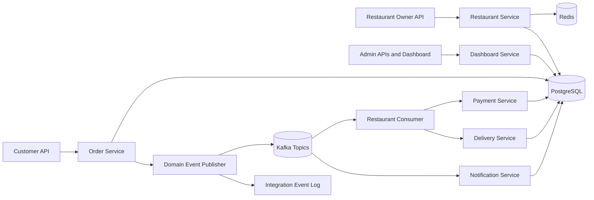

# Event-Driven Order Delivery System

Backend service for managing restaurant ordering, payment simulation, delivery assignment, customer notifications, and administrative monitoring. The system is built around a modular Spring Boot architecture with durable PostgreSQL persistence, JWT-secured APIs, Redis-backed read caching, and Kafka-ready domain events.

## Tech Stack

- Java 21, Spring Boot 3, Spring Security, JWT
- PostgreSQL, JPA/Hibernate
- Kafka producers, consumers, retry topics, and DLT handlers
- Redis cache for restaurant and menu read paths
- Docker, Docker Compose, Swagger/OpenAPI
- JUnit, MockMvc, Testcontainers scaffolding

## Core Capabilities

- Register and authenticate users with role-based API access.
- Manage restaurants and menu items through owner/admin APIs.
- Search restaurants by query, cuisine, and location.
- Create customer orders with persisted line items and calculated totals.
- Enforce order status transitions through a central policy.
- Simulate payment success, failure, refund, cancellation, and delivery assignment.
- Track delivery status and synchronize it with order progress.
- Publish or locally audit order, payment, delivery, and notification events.
- Expose admin metrics, recent orders, and integration event history.
- Provide an interactive dashboard UI and Swagger API documentation.

## Architecture



## Service Responsibilities

- **Auth/User**: registration, login, BCrypt password hashing, JWT generation, current-user lookup, admin user listing.
- **Restaurant/Menu**: owner-controlled restaurant CRUD, menu management, public browse/search endpoints, Redis cache integration.
- **Order**: customer order placement, order item snapshots, total calculation, order lookup, status transition enforcement.
- **Payment**: payment record creation, success/failure simulation, refund simulation, cancellation handling.
- **Delivery**: delivery record creation, agent assignment, ETA calculation, status updates, order-status synchronization.
- **Notification**: notification event capture for order and delivery status changes.
- **Admin**: aggregate dashboard metrics and integration event audit visibility.

## Order Lifecycle

Supported order states:

```text
PLACED -> ACCEPTED -> PREPARING -> READY -> PICKED_UP -> DELIVERED
```

Cancellation is allowed only before pickup:

```text
PLACED -> CANCELLED
ACCEPTED -> CANCELLED
PREPARING -> CANCELLED
READY -> CANCELLED
```

`OrderStatusPolicy` blocks invalid jumps such as `PLACED -> READY`, keeping order progression explicit and auditable.

## Event Flow

The application can run in two event modes:

- **Kafka mode**: publishes to Kafka topics and consumes events through service-specific listeners.
- **Local audit mode**: stores integration events in PostgreSQL when Kafka is disabled.

Topics used by the system:

```text
order.placed
payment.requested
delivery.requested
order.status.changed
notification.events
```

Kafka listeners use retry topics and DLT handlers. Admins can inspect event history through `GET /api/admin/events`.

## Runtime Modes

### Full Local Infrastructure

Use Docker Compose for PostgreSQL, Redis, Kafka, and Zookeeper:

```bash
docker compose up -d
mvn spring-boot:run
```

Then open:

```text
http://localhost:8080/
http://localhost:8080/swagger-ui.html
http://localhost:8080/api/health
```

### Low-Cost Cloud Runtime

For a simple cloud deployment, run the app on Render with Neon PostgreSQL and Upstash Redis. Set `KAFKA_ENABLED=false` first so events are stored in the database audit log. Real managed Kafka can be enabled later.

See `DEPLOYMENT.md` for the full deployment guide.

## Main Endpoints

- `POST /api/auth/register`
- `POST /api/auth/login`
- `GET /api/users/me`
- `GET /api/users`
- `POST /api/restaurants`
- `GET /api/restaurants`
- `GET /api/restaurants/{id}`
- `POST /api/restaurants/{id}/menu`
- `GET /api/restaurants/{id}/menu`
- `POST /api/orders`
- `GET /api/orders/my`
- `GET /api/orders/{id}`
- `PATCH /api/orders/{id}/status`
- `POST /api/payments/{orderId}/simulate`
- `POST /api/payments/{orderId}/refund`
- `POST /api/deliveries/{orderId}/assign`
- `PATCH /api/deliveries/{orderId}/status`
- `GET /api/admin/dashboard`
- `GET /api/admin/events`

## Testing

Run the default test suite:

```bash
mvn test
```

The test suite covers authentication, authorization, restaurant/menu management, order lifecycle rules, local event auditing, payment/delivery simulation, health checks, and admin dashboard access.

The default tests use H2 in PostgreSQL compatibility mode for fast endpoint coverage. Testcontainers scaffolding is included for PostgreSQL/Kafka infrastructure smoke tests and is skipped automatically when Docker is unavailable.

## Postman

Import:

```text
postman/order-delivery.postman_collection.json
```

Set the collection `baseUrl`, register or login, then place the JWT in the `token` collection variable.

## Deployment

The repository includes:

- `Dockerfile` for cloud container builds.
- `render.yaml` for Render Blueprint deployment.
- `.env.example` for local environment variable shape.
- `DEPLOYMENT.md` with step-by-step Render, Neon, Upstash, and optional Kafka setup.

## Engineering Decisions

- **Kafka-ready event model**: order, payment, delivery, and notification work are decoupled through domain events while local audit mode keeps the system runnable without external Kafka.
- **Centralized status policy**: order progression rules live in one place instead of being scattered across controllers.
- **Role-based authorization**: Spring Security and JWT protect customer, owner, delivery-agent, and admin workflows.
- **Read-path caching**: Redis targets restaurant and menu browsing, the highest-volume read areas.
- **Dockerized runtime**: the same build path works locally and on Docker-capable cloud hosts.
- **Operational visibility**: admin APIs expose dashboard metrics and integration event history for troubleshooting.
