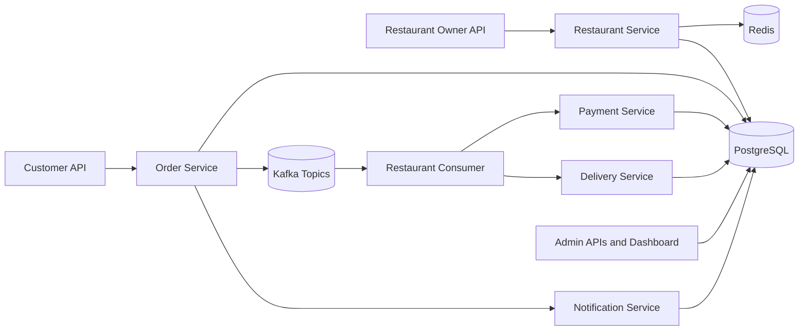

# Event-Driven Order Delivery System

Mini Swiggy/Zomato-style backend focused on real backend engineering: modular Spring Boot services, JWT security, PostgreSQL persistence, Kafka event flow, Redis caching, Docker setup, endpoint tests, and an immersive admin dashboard.

## Tech Stack

- Java 21, Spring Boot 3, Spring Security, JWT
- PostgreSQL, JPA/Hibernate
- Kafka with retry topics and DLT handlers
- Redis cache for restaurant/menu reads
- Docker Compose, Swagger/OpenAPI
- JUnit, MockMvc, Testcontainers scaffolding

## Architecture



## Sprint Plan

1. **Project setup and base architecture**: Spring Boot, layered packages, PostgreSQL config, Docker Compose, Swagger, validation, global exceptions, health check.
2. **Authentication and user management**: register/login, JWT, role-based APIs, password hashing.
3. **Restaurant and menu system**: owner CRUD, menu management, search/filter, Redis cache hooks.
4. **Order lifecycle**: order creation, item persistence, total calculation, protected status transitions.
5. **Kafka event flow**: order/payment/delivery/notification events with retryable listeners.
6. **Payment and delivery simulation**: simulated payment, delivery assignment/status, ETA, cancellation/refund path.
7. **Testing and polish**: unit/integration tests, Testcontainers scaffolding, API docs, Postman collection, deployment notes.

## Run Locally

```bash
docker compose up -d
mvn spring-boot:run
```

Open Swagger at `http://localhost:8080/swagger-ui.html` and the dashboard at `http://localhost:8080/`.

Kafka topics are created for `order.placed`, `payment.requested`, `delivery.requested`, `order.status.changed`, and `notification.events`. Consumers use retry topics plus DLT handlers, and `/api/admin/events` exposes the event audit trail for admins.

Payment and delivery simulation endpoints support success/failure, refunds, delivery-agent assignment, ETA tracking, and delivery status updates that keep the order lifecycle consistent.

## Main Endpoints

- `POST /api/auth/register`, `POST /api/auth/login`
- `GET /api/users/me`, `GET /api/users`
- `POST /api/restaurants`, `GET /api/restaurants`, `POST /api/restaurants/{id}/menu`
- `POST /api/orders`, `GET /api/orders/my`, `PATCH /api/orders/{id}/status`
- `POST /api/payments/{orderId}/simulate`, `POST /api/payments/{orderId}/refund`
- `POST /api/deliveries/{orderId}/assign`, `PATCH /api/deliveries/{orderId}/status`
- `GET /api/admin/dashboard`, `GET /api/admin/events`

## Testing

```bash
mvn test
```

The default suite uses H2 with PostgreSQL compatibility for fast endpoint coverage. Docker-based PostgreSQL/Kafka Testcontainers scaffolding lives in `InfrastructureSmokeIT` and is skipped automatically when Docker is unavailable.

## Postman

Import `postman/order-delivery.postman_collection.json`, set `baseUrl`, then register/login and copy the JWT into the `token` collection variable.

## Deployment

See `DEPLOYMENT.md` for the detailed free deployment path using Render, Neon PostgreSQL, and Upstash Redis, plus the optional managed Kafka upgrade path.

## Interview Talking Points

- Kafka decouples order creation from restaurant, payment, delivery, and notification work.
- `OrderStatusPolicy` prevents invalid jumps such as `PLACED` directly to `READY`.
- JWT embeds identity while Spring method security enforces role-specific APIs.
- Redis caches restaurant/menu reads, which are high-volume browse paths.
- Docker Compose makes local infrastructure reproducible, while the Dockerfile supports cloud deployment.
